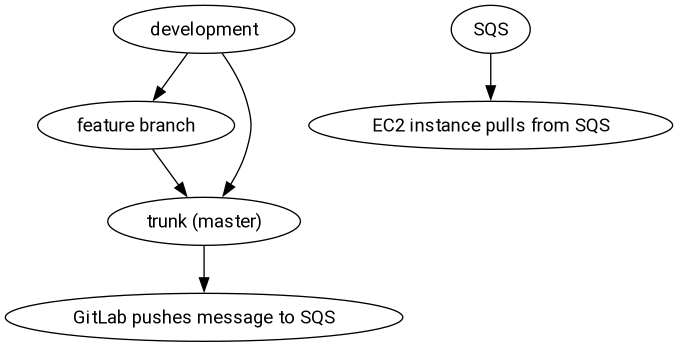

* Joe's EC2 Dotfiles

This is how I like to do my cloud computing, with reproducibility and NixOS.

* Running NixOS on an AWS AMI on EC2

See https://nixos.org/download.html#nixos-amazon for more ways to get NixOS, also on Amazon AWS EC2.

* Cloud Infra

I provision my cloud infrastructure with Nix, and also this AWS config gets magically deployed with it.

See [[https://github.com/jjba23/cloud-infra][my cloud infrastructure]] for more context and info.

* WikiMusic

This config runs among other things my project, WikiMusic. You might need some prior setup.

* Deployment model of these dotfiles via CI/CD

#+BEGIN_SRC dot :file resources/images/dotfiles-deployment-model.png :exports results :mkdirp yes
  digraph mygraph {
    fontname="Roboto,Helvetica,Arial,sans-serif"
    node [fontname="Roboto,Helvetica,Arial,sans-serif"]
    edge [fontname="Roboto,Helvetica,Arial,sans-serif"]
    node [shape=oval];

    development -> "feature branch"
    development -> "trunk (master)"
    "feature branch" -> "trunk (master)"
    "trunk (master)" -> "GitHub pushes message to SQS"

    SQS -> "EC2 instance pulls from SQS"
  }
#+END_SRC

#+RESULTS:

